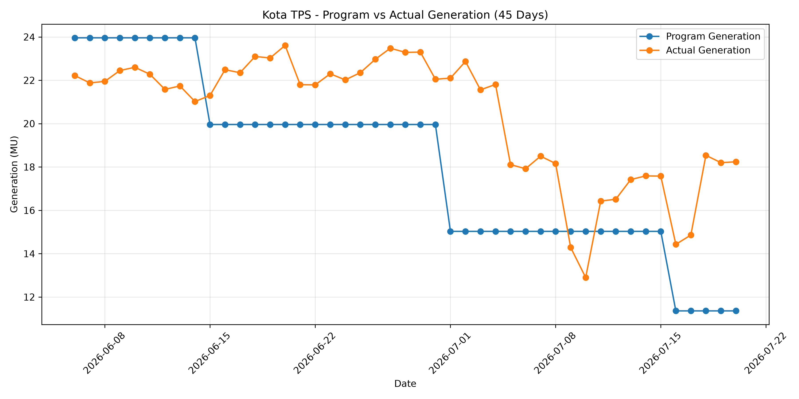
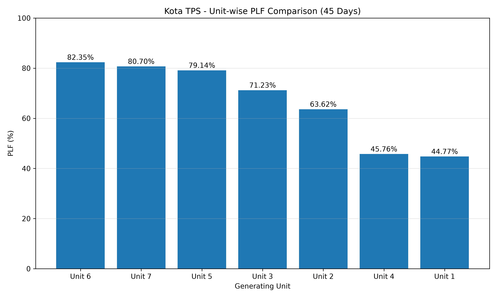
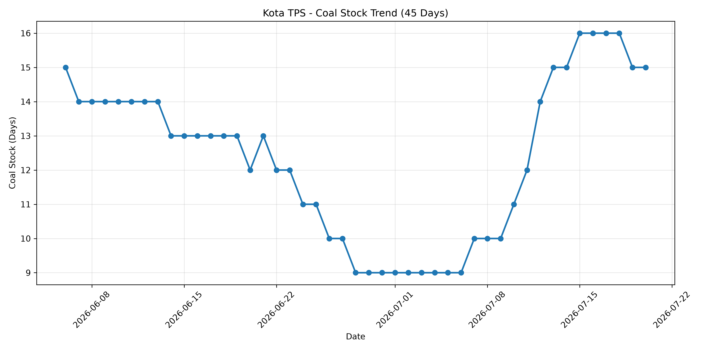
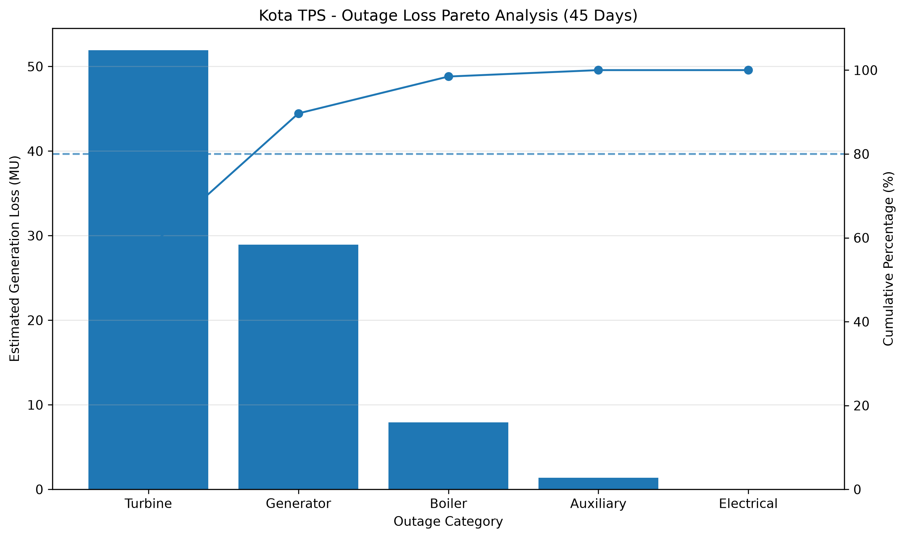

# Kota TPS – Generation, PLF, Outage & Coal Stock Analytics

## Project Overview

This project analyzes the operational performance of **Kota Super Thermal Power Station (Kota TPS), Rajasthan** using power-generation data for the period **06 June 2026 to 20 July 2026**.

The analysis focuses on **power generation, Plant Load Factor (PLF), unit-wise performance, generation variance, outage patterns, estimated generation loss, and coal-stock trends**.

The complete analytics workflow was developed using **Excel, SQL, Python, and Power BI**, covering data preparation, analysis, visualization, and interactive dashboard development.

---

## Objectives

- Analyze daily and unit-wise power generation.
- Compare actual generation with programmed generation.
- Evaluate Plant Load Factor (PLF) across generating units.
- Analyze outage frequency and outage capacity.
- Identify units most affected by outages.
- Estimate generation loss associated with unit performance.
- Analyze coal-stock trends over the study period.
- Build an interactive Power BI dashboard for performance monitoring.

---

## Technology Stack

| Tool | Usage |
|---|---|
| Excel | Data cleaning, preparation and validation |
| SQL | Data preparation, querying and KPI analysis |
| Python | Exploratory data analysis and visualization |
| Pandas | Data manipulation and analysis |
| NumPy | Numerical operations |
| Matplotlib | Data visualization |
| Power BI | Interactive dashboard and KPI visualization |
| DAX | Measures and calculated KPIs in Power BI |

---

## Dataset

The analysis covers **45 days**, from **06 June 2026 to 20 July 2026**.

Kota TPS consists of **7 generating units** with a total installed capacity of **1240 MW**:

| Unit | Capacity |
|---|---:|
| Unit 1 | 110 MW |
| Unit 2 | 110 MW |
| Unit 3 | 210 MW |
| Unit 4 | 210 MW |
| Unit 5 | 210 MW |
| Unit 6 | 195 MW |
| Unit 7 | 195 MW |
| **Total** | **1240 MW** |

The repository contains raw and cleaned datasets used during the project, including station-level and unit-level analytical datasets.

---

## Data Source

The dataset used in this project was sourced from publicly available **National Power Portal (NPP) daily generation reports** for the period **06 June 2026 to 20 July 2026**.

The analysis focuses specifically on **Kota Super Thermal Power Station (Kota TPS), Rajasthan** and was carried out as part of a data analytics project associated with my internship at Kota Super Thermal Power Station.

---

## Project Workflow

### 1. Excel – Data Preparation

Raw operational data was organized, cleaned and validated in Excel to create analysis-ready datasets.

Two primary analytical datasets were prepared:

- **Station-level daily dataset**
- **Unit-level daily dataset**

Additional calculated fields were created for further analysis.

### 2. SQL – Data Analysis

SQL was used for:

- Data preparation and validation
- Generation analysis
- Unit-wise performance analysis
- PLF analysis
- Generation variance analysis
- Outage analysis
- Coal-stock analysis
- KPI aggregation

### 3. Python – Exploratory Data Analysis

Python was used to perform exploratory data analysis and generate visualizations using:

- **Pandas**
- **NumPy**
- **Matplotlib**

The analysis included generation trends, unit-wise PLF comparison, coal-stock trends and outage-related analysis.

### 4. Power BI – Interactive Dashboard

A **four-page interactive Power BI dashboard** was developed to present the final analytical results and operational KPIs.

---

## Power BI Dashboard

The dashboard contains four analytical pages:

### 1. Plant Overview

Provides an overall view of plant performance using:

- Plant capacity
- Total actual generation
- Program generation
- Average PLF
- Peak outage capacity
- Daily generation trends
- Coal-stock trends
- Outage-capacity trends

### 2. Unit-Wise Performance Analysis

Compares the seven generating units using:

- Actual vs program generation
- Generation variance
- Average PLF
- Estimated generation loss
- Best-performing unit
- Highest-generation unit
- Most affected units

### 3. Outage Analysis

Analyzes operational outages using:

- Outage records by unit
- Maximum outage capacity
- Outage-capacity trend
- Outage categories
- Most affected unit
- Leading outage categories

### 4. Coal & Operational Trends

Analyzes:

- Coal-stock trend
- Daily generation trend
- Daily change in coal stock
- Actual vs program generation
- Average, minimum and maximum coal-stock levels

> **Live Interactive Dashboard:** Link will be added after Power BI deployment.

---

## Key Dashboard Indicators

| KPI | Result |
|---|---:|
| Plant Capacity | **1240 MW** |
| Total Generation | **916.97 MU** |
| Program Generation | **817.25 MU** |
| Average PLF | **68.47%** |
| Station-Level Peak Outage | **530 MW** |
| Total Unit-Level Outage Records | **35** |
| Most Affected Unit | **Unit 4** |
| Best PLF Unit | **Unit 6** |
| Highest Generation Unit | **Unit 5** |
| Highest Estimated Loss Unit | **Unit 4** |
| Average Coal Stock | **12.31 Days** |
| Minimum Coal Stock | **9 Days** |
| Maximum Coal Stock | **16 Days** |
| Average Daily Generation | **20.38 MU** |

---

## Key Insights

- Kota TPS generated **916.97 MU** during the 45-day study period compared with **817.25 MU of programmed generation**.

- The station recorded an **average PLF of 68.47%** during the analysis period.

- **Unit 6** recorded the highest average PLF among the seven generating units.

- **Unit 5** recorded the highest total generation during the study period.

- **Unit 4** was the most affected unit based on outage records and also recorded the highest estimated generation loss in the analysis.

- A total of **35 unit-level outage records** were identified.

- **Generator and Turbine-related outages were jointly the most frequent categories**, with **15 flagged records each**.

- Station-level outage capacity reached a maximum of **530 MW** during the study period.

- Coal stock averaged **12.31 days**, with observed values ranging from a minimum of **9 days** to a maximum of **16 days**.

- The combined analysis indicates that unit outages were an important factor influencing generation performance during the study period.

---

## Limitations

- The available dataset primarily contains generation, outage-capacity and coal-stock information.

- The dataset does **not contain sufficient fuel-consumption or heat-rate information to calculate true thermal efficiency**.

- Therefore, the project focuses on generation-based operational performance indicators such as **PLF, generation variance, outages and coal-stock trends**, rather than claiming direct thermal-efficiency measurement.

- `Est_Loss_MU` represents an **Estimated Generation Loss** derived during the analysis. It should not be interpreted as an official generation-loss figure reported by the power station or utility.

- The analysis covers a **45-day period**, from 06 June 2026 to 20 July 2026. Therefore, the findings describe performance during this specific study period and should not be interpreted as long-term or seasonal plant-performance conclusions.

---

## Repository Structure

```text
Kota-TPS-Generation-Outage-Analytics/
│
├── DATA/
│   ├── Kota_TPS_Raw_Data.xlsx
│   ├── Kota_TPS_Cleaned_Workbook.xlsx
│   ├── station_daily.csv
│   └── unit_daily.csv
│
├── SQL/
│   ├── Kota_TPS_Data_Preparation.sql
│   └── Kota_TPS_Analysis.sql
│
├── PYTHON/
│   └── analysis.py
│
├── IMAGES/
│   ├── coal_stock_trend.png
│   ├── outage_pareto_analysis.png
│   ├── station_generation_trend.png
│   └── unit_wise_plf_comparison.png
│
├── POWERBI/
│   └── Kota_TPS_Dashboard.pbix
│
└── README.md
```

---

## Python Visualizations

The `IMAGES` folder contains visualizations generated during Python exploratory data analysis.

### Station Generation Trend



### Unit-Wise PLF Comparison



### Coal Stock Trend



### Outage Pareto Analysis



---

## Key Skills Demonstrated

`Data Cleaning` · `Data Analysis` · `Excel` · `SQL` · `Python` · `Pandas` · `NumPy` · `Matplotlib` · `Power BI` · `DAX` · `Exploratory Data Analysis` · `Data Visualization` · `Dashboard Development`

---

## Author

**Shelly Sharma**  


---

*This project was developed as a data analytics and performance-monitoring project using publicly available power-sector data.*


